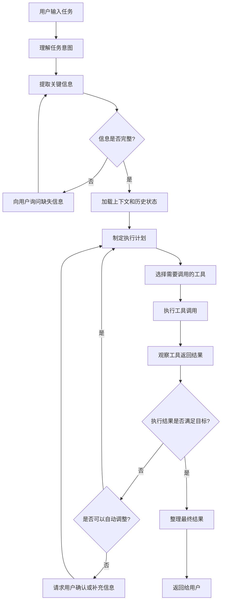
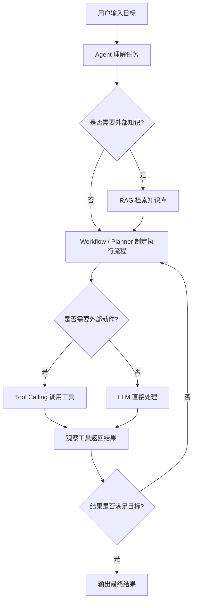

# 阶段 1：建立 Agent 的基础认知

## 一. 什么是 Agent
Agent 可以理解为一种以大模型为核心的任务执行系统。

它不是简单地“回答问题”，而是能够围绕用户目标，完成一系列动作：

```
理解目标 → 制定计划 → 调用工具 → 执行任务 → 观察结果 → 持续调整 → 输出结果
```

更简单地说：

Chatbot 主要负责“回答”；Agent 主要负责“完成任务”。

例如，用户说：

> 帮我规划一个成都出发的 5 天自驾游路线。

普通 Chatbot 可能直接生成一份路线。

Agent 则会进一步做这些事：

1. 识别用户目标：规划自驾游路线；
2. 补齐关键信息：预算、人数、偏好、是否接受高海拔；
3. 查询外部信息：天气、路况、景点开放时间、酒店价格；
4. 制定路线方案；
5. 检查路线是否合理；
6. 根据用户反馈继续修改；
7. 最终输出结构化行程。

所以，Agent 的核心不是“会说”，而是：**能围绕目标，持续决策并完成任务**。

## 二. Agent 的基本组成
一个完整的 Agent 通常由以下几个部分组成：

| 组成部分           | 作用                       |
| -------------- | ------------------------ |
| 大模型 / LLM      | 负责理解、推理、规划、生成结果          |
| 任务目标           | 明确 Agent 要完成什么事情         |
| 上下文 / State    | 保存当前任务的状态、历史信息、用户偏好      |
| 规划器 / Planner  | 将复杂任务拆解成多个可执行步骤          |
| 工具 / Tools     | 调用外部能力，例如搜索、数据库、API、代码执行 |
| 知识系统 / RAG     | 从知识库中检索相关资料，增强回答准确性      |
| 执行器 / Executor | 按照计划执行具体步骤               |
| 反馈机制           | 根据执行结果判断是否继续、重试或调整计划     |
| 人工介入 / HITL    | 在信息不足、高风险或需要确认时询问用户      |

可以简单理解为：
```
Agent = LLM + 目标 + 状态 + 规划 + 工具 + 执行 + 反馈
```

## 三. Agent 的任务执行流程

典型的 Agent 的任务执行流程：



一般来说，Agent 的任务执行流程的组成为：
| 组成             | 类比    | 作用         |
| -------------- | ----- | ---------- |
| Prompt         | 工作说明书 | 约束模型行为     |
| DAG / Workflow | 流程图   | 控制执行顺序     |
| AI Planner     | 临时决策者 | 处理不确定任务    |
| Tool           | 工具箱   | 执行真实动作     |
| State          | 工作台记录 | 保存上下文和中间结果 |
| Guardrails     | 质检规则  | 防止越界和错误    |

工程上推荐的实现方式：混合架构

真正可落地的 Agent，一般不会完全依赖提示词，也不会完全放任 AI 自主规划。

更推荐这种方式：

```
外层：DAG / 状态机控制主流程
内层：LLM 负责语义判断、信息抽取、局部规划
工具层：负责真实执行
校验层：负责结果验证
状态层：负责过程记忆
```


## 四. Agent 和 RAG、Workflow、Tool Calling 的关系
Agent、RAG、Workflow、Tool Calling 不是同一层级的概念。

更准确地说：

> Agent 是目标驱动的任务执行系统；RAG、Workflow、Tool Calling 是实现 Agent 的关键能力或基础组件。

| 概念           | 本质     | 解决什么问题        |
| ------------ | ------ | ------------- |
| Agent        | 任务执行系统 | 如何围绕目标完成任务    |
| RAG          | 知识增强机制 | 如何获取外部知识      |
| Workflow     | 流程编排机制 | 如何控制任务步骤      |
| Tool Calling | 工具调用机制 | 如何让 AI 执行外部动作 |

它们之间的关系可以理解为：

> Agent = LLM + State + Workflow + Tool Calling + RAG + Memory + Guardrails


其中：

```text
Workflow 负责流程
Tool Calling 负责动作
RAG 负责知识
Agent 负责目标驱动和整体决策
```

### 1、Agent 和 RAG 的关系

RAG，全称是 Retrieval-Augmented Generation，也就是**检索增强生成**。

它的核心作用是：

> 当大模型自身知识不够、知识过时、或者需要依赖私有资料时，先从知识库中检索相关内容，再让模型基于这些内容生成答案。

例如用户问：

```text
根据我们公司的报销制度，出差住宿费可以报销多少？
```

大模型本身不知道你公司的制度，这时候就需要 RAG：

```text
用户问题
→ 检索公司制度文档
→ 找到相关条款
→ 将条款交给 LLM
→ 生成回答
```

所以，RAG 解决的是：

> **Agent 不知道时，如何查资料。**

但是，RAG 本身不是 Agent。

因为 RAG 通常只完成：

```text
检索 → 生成
```

它不一定具备：

```text
任务规划
多步骤执行
工具调用
状态管理
失败重试
人工确认
```

所以二者关系是：

> **RAG 是 Agent 的知识获取能力，Agent 可以使用 RAG，但 RAG 不等于 Agent。**

例如一个企业知识问答 Agent 可能是这样：

```text
用户提问
→ Agent 判断是否需要查知识库
→ 调用 RAG 检索制度文档
→ 基于检索结果生成答案
→ 如果资料不足，继续追问或扩大检索范围
→ 输出最终回答
```

在这个过程中，RAG 是 Agent 的一个能力模块。


### 2、Agent 和 Workflow 的关系

Workflow 是**流程编排机制**。

它解决的问题是：

> 一个任务应该按照什么步骤执行，每一步完成后应该进入哪里。

例如一个资料分析任务可以设计成 Workflow：

```text
接收资料
→ 解析资料
→ 提取事实
→ 识别问题
→ 分析原因
→ 生成建议
→ 校验结果
→ 输出报告
```

Workflow 的特点是：

| 特点     | 说明            |
| ------ | ------------- |
| 流程明确   | 先做什么、后做什么是确定的 |
| 可控性强   | 可以限制模型不能乱跳步骤  |
| 可审计    | 每一步输入输出都能记录   |
| 易恢复    | 失败后可以从某个节点继续  |
| 适合工程落地 | 尤其适合企业级业务流程   |

但是 Workflow 本身也不等于 Agent。

因为普通 Workflow 可以完全没有 AI。

例如：

```text
用户提交表单
→ 系统审核
→ 发送通知
→ 更新数据库
```

这是 Workflow，但不是 Agent。

当 Workflow 中的某些节点由 LLM 来完成时，它就变成了 Agent 的一种实现方式。

例如：

```text
用户输入
→ 意图识别节点：LLM
→ 信息抽取节点：LLM
→ 工具执行节点：系统
→ 结果校验节点：规则 + LLM
→ 输出节点：LLM
```

所以二者关系是：

> **Workflow 是 Agent 的流程骨架，Agent 可以基于 Workflow 实现稳定、可控的任务执行。**

工程上，推荐的方式通常是：

```text
Workflow 控制主流程
LLM 负责语义判断
Tool 执行外部动作
State 保存过程状态
```

也就是说：

> 不要完全放任 AI 自主行动，而是让 Workflow 控制边界，让 AI 在节点内部发挥能力。


### 3、Agent 和 Tool Calling 的关系

Tool Calling 是**让大模型调用外部工具的机制**。

它解决的问题是：

> 大模型不能直接查数据库、发邮件、查天气、读文件、执行代码，怎么办？

答案就是：通过 Tool Calling。

例如：

```text
用户：帮我查一下明天成都天气
```

模型不能凭空知道明天天气，所以它需要调用天气工具：

```text
LLM 判断需要查天气
→ 调用 weather_tool
→ 获取天气结果
→ 整理成自然语言回答
```

Tool Calling 可以调用很多类型的工具：

```text
搜索工具
数据库工具
日历工具
邮件工具
地图工具
代码执行工具
文件解析工具
支付工具
业务系统 API
```

但是，Tool Calling 本身也不是 Agent。

因为 Tool Calling 只是一个动作接口。

它只解决：

```text
如何调用工具
```

不解决：

```text
什么时候调用
为什么调用
调用失败怎么办
多个工具如何编排
结果如何验证
任务是否完成
```

这些才是 Agent 要处理的问题。

所以二者关系是：

> **Tool Calling 是 Agent 的行动能力，Agent 通过 Tool Calling 从“会说”变成“会做”。**

没有 Tool Calling 的 Agent，通常只能停留在“生成建议”。

有了 Tool Calling，Agent 才能真正执行任务：

```text
查资料
改数据
发邮件
建日程
生成文件
调用接口
执行代码
```

### 4、四者之间的整体关系

可以用一个流程图理解：



可以看出：

```text
Agent 是外层主体
Workflow 控制过程
RAG 提供知识
Tool Calling 执行动作
```